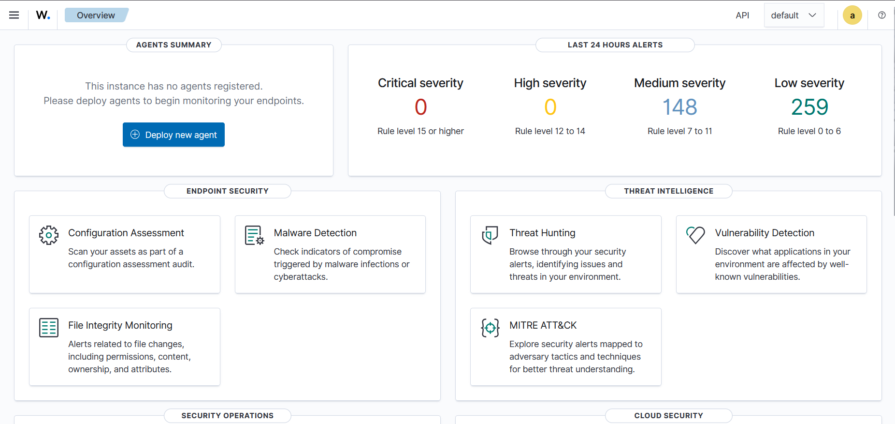
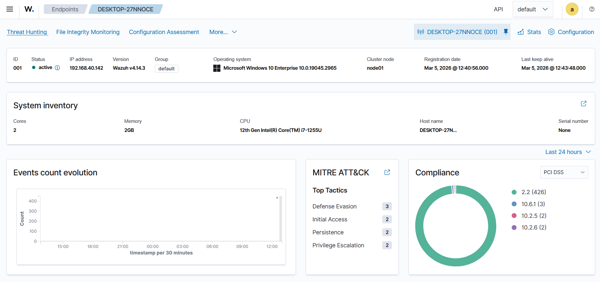
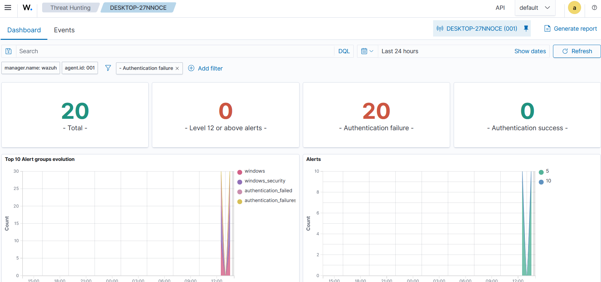
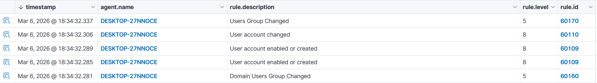

# Wazuh SOC Home Lab

## Overview

This project demonstrates how to build a small Security Operations Center (SOC) lab using **Wazuh SIEM** to collect logs, simulate attacks, and detect security events.

The objective of this lab is to understand how SOC analysts monitor endpoints and investigate security alerts.

The lab simulates a simple attack scenario where a Windows endpoint sends logs to a Wazuh SIEM server and different attack techniques generate security alerts.

---

## Lab Architecture

```
Kali Linux (Attacker)
        │
        │ Attack simulation
        ▼
Windows Endpoint (Wazuh Agent)
        │
        │ Security Logs
        ▼
Wazuh SIEM Server
 ├── Wazuh Manager
 ├── Wazuh Indexer
 └── Wazuh Dashboard
```

---

## Technologies Used

- Wazuh SIEM
- Ubuntu Server
- Windows 10 Endpoint
- Kali Linux
- PowerShell
- Nmap

---

## Wazuh Server Installation

Update the system and download the Wazuh installation script.

```bash
sudo su
apt update && apt upgrade -y
curl -sO https://packages.wazuh.com/4.14/wazuh-install.sh
```

Create the configuration file.

```bash
nano config.yml
```

Configuration:

```yaml
nodes:
  indexer:
    - name: wazuh-indexer
      ip: "127.0.0.1"

  server:
    - name: wazuh-1
      ip: "127.0.0.1"

  dashboard:
    - name: wazuh-dashboard
      ip: "127.0.0.1"
```

Generate configuration files.

```bash
bash wazuh-install.sh --generate-config-files
```

Install the components.

### Install Wazuh Indexer

```bash
bash wazuh-install.sh --wazuh-indexer wazuh-indexer
```

### Install Wazuh Server

```bash
bash wazuh-install.sh --wazuh-server wazuh-1
```

### Start Cluster

```bash
bash wazuh-install.sh --start-cluster
```

### Install Wazuh Dashboard

```bash
bash wazuh-install.sh --wazuh-dashboard wazuh-dashboard
```

---

## Retrieve Credentials

The dashboard credentials can be found in the installation files.

```bash
tar -xf wazuh-install-files.tar
cat wazuh-install-files/wazuh-passwords.txt
```

---

## Windows Agent Installation

Install the Wazuh agent on the Windows machine.

```powershell
Invoke-WebRequest -Uri https://packages.wazuh.com/4.x/windows/wazuh-agent-4.14.3-1.msi -OutFile $env:tmp\wazuh-agent; msiexec.exe /i $env:tmp\wazuh-agent /q WAZUH_MANAGER='192.168.40.143'
```

Start the service.

```powershell
NET START Wazuh
```

Once connected, the endpoint becomes visible in the Wazuh dashboard.

---

## Attack Simulation

### Brute Force Login Attempt

```powershell
for ($i=1; $i -le 20; $i++) { net use \\127.0.0.1\IPC$ /user:test wrongpassword }
```

Detection in Wazuh:

```
Event ID 4625
Authentication failure
```

---

### User Account Creation

```powershell
net user hacker Test123! /add
```

Detection:

```
Event ID 4720
User account created
```

---

### Network Reconnaissance

From Kali Linux:

```bash
nmap -A IP_WINDOWS
```

This simulates the reconnaissance phase of an attack.

---

## Detection in Wazuh

Security events can be analyzed in:

- Security Events
- Threat Hunting

Filter example:

```
agent.name: DESKTOP-27NNOCE
```

This allows monitoring logs generated by the Windows endpoint.

---

## Screenshots

### Wazuh Login


### Wazuh Dashboard



### Agent Deployment



### Authentication Failures



### User Creation Detection



---

## Key Learnings

Through this project I learned:

- How to deploy a SIEM environment
- How endpoints send logs to a SIEM
- How Windows security events are generated
- How common attacks appear in logs
- How SOC analysts investigate alerts

---

## Future Improvements

Possible improvements for this lab:

- Install Sysmon for advanced Windows telemetry
- Integrate Suricata IDS
- Simulate MITRE ATT&CK techniques
- Build detection rules

---

## Disclaimer

This project was built in a controlled lab environment for educational purposes.
